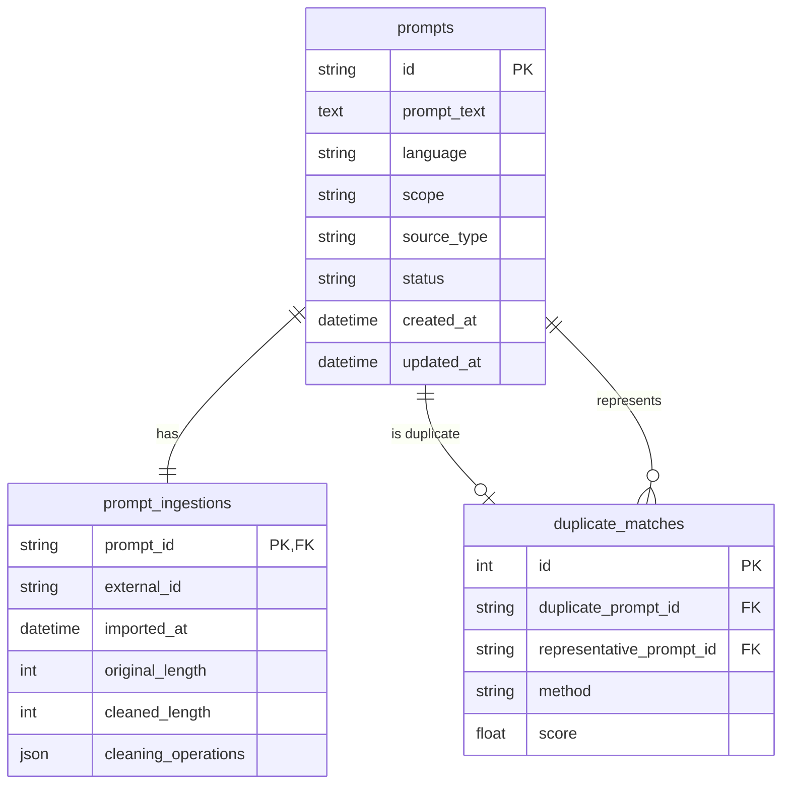

# SQLite 持久化设计

第 6 步使用 SQLAlchemy 2.x 将清洗、去重结果持久化。开发环境默认使用 SQLite，ORM 层保留后续切换 PostgreSQL 的空间。

## 表关系



## 设计决策

- 所有 Prompt 都写入数据库，包括重复项；
- 重复项使用 `status=duplicate`，不做物理删除；
- 一个 Prompt 最多作为一个代表项的重复项；
- 一个代表项可以对应多个重复项；
- 导入元数据与 Prompt 一对一，避免核心表字段持续膨胀；
- `cleaning_operations` 是长度不固定的小型审计列表，当前使用 JSON；
- scope、source_type、status、method 使用字符串，减少 SQLite 与 PostgreSQL 枚举迁移差异；
- 外键约束在 SQLite 连接建立时显式启用。

## 幂等同步

`synchronize_deduplication()` 可以重复执行：

1. 根据 Prompt ID 新增或更新记录；
2. 删除本批 Prompt 旧的重复关系；
3. 将本批状态重置为待标注；
4. 写入本次重复关系并更新重复状态；
5. 整个过程在一个 Session 事务中提交。

任一步失败都会回滚，不留下只写入一半的数据。

## 运行

```bash
creativebench-db init

creativebench-db load \
  --prompts data/processed/dedup_input.jsonl \
  --duplicates data/processed/duplicate_report.jsonl

creativebench-db stats
```

默认数据库为 `data/creativebench.db`，已被 Git 忽略。

## 当前边界

当前使用 `Base.metadata.create_all()` 初始化 MVP 表结构，没有引入 Alembic。分类标签、模型预测、人工审核和向量索引将在对应步骤加入；正式部署前再建立数据库迁移脚本。
